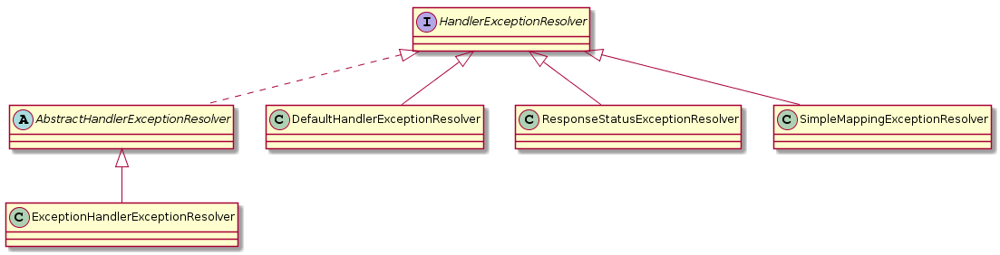
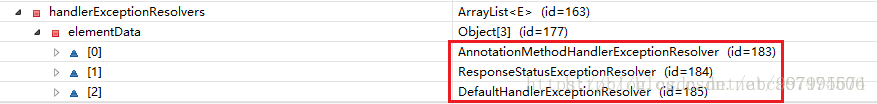
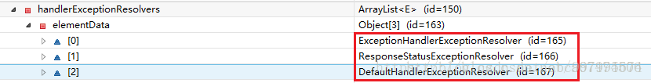
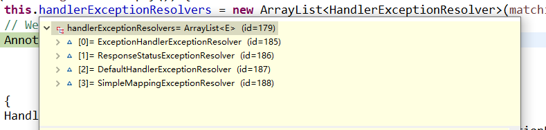

## spring 异常统一处理

#### 1、HandlerExceptionResolver异常处理

###### 1.1接口关系：



###### 1.2 DispatcherServlet 装配HandlerExceptionResolver 

1.2.1 默认情况下handlerExceptionResolvers 装配AnnotationMethodHandlerExceptionResolver，ResponseStatusExceptionResolver，DefaultHandlerExceptionResolver；截图如下（借用图）



1.2.2 配置`<mvc:annotation-driven/>`情况下，装配ExceptionHandlerExceptionResolver，ResponseStatusExceptionResolver，DefaultHandlerExceptionResolver截图如下（借用图）：



1.2.3 配置 SimpleMappingExceptionResolver情况下，具体实例见后面,装配装配ExceptionHandlerExceptionResolver，ResponseStatusExceptionResolver，DefaultHandlerExceptionResolver，SimpleMappingExceptionResolver



- ExceptionHandlerExceptionResolver主要是解析Handler中用 @ExceptionHandler注解定义的方法。
- ResponseStatusExceptionResolver，自定义一个异常类,使用@ResponseStatus 注解标注。若在处理器方法中抛出了这个异常,由于触发的异常带有@ResponseStatus注解。因此会被ResponseStatusExceptionResolver解析到。最后响应HttpStatus.xx状态码和reason信息给客户端。、
- DefaultHandlerExceptionResolver，对一些特殊的异常进行处理，比如NoSuchRequestHandlingMethodException、HttpRequestMethodNotSupportedException、HttpMediaTypeNotSupportedException、HttpMediaTypeNotAcceptableException等。
- SimpleMappingExceptionResolver 映射特定的页面

#### 2、异常统一处理

###### 2.1 3种实现方式

- 使用Spring MVC提供的简单异常处理器SimpleMappingExceptionResolver； 
- 实现Spring的异常处理接口HandlerExceptionResolver 自定义自己的异常处理器；
- 使用@ExceptionHandler注解实现异常处理；
- 使用@ExceptionHandler，@ControllerAdvice注解实现异常处理；

第一种方式，配置spring-mvc.xml

```xml
<bean class="org.springframework.web.servlet.handler.SimpleMappingExceptionResolver">  
	   <!--  定义默认的异常处理页面，当该异常类型的注册时使用   -->
	    <property name="defaultErrorView" value="error"></property>  
	    <!-- 定义异常处理页面用来获取异常信息的变量名，默认名为exception -->  
	    <property name="exceptionAttribute" value="ex"></property>  
	    <!-- 定义需要特殊处理的异常，用类名或完全路径名作为key，异常也页名作为值 -->  
	    <property name="exceptionMappings">  
	        <props>  
	            <prop key="com.github.kh.spring.exception.example.exception.BusinessException">error-business</prop>  
	            <prop key="com.github.kh.spring.exception.example.exception.ParameterException">error-parameter</prop>  
	  
	            <!-- 这里还可以继续扩展对不同异常类型的处理   -->
	        </props>  
	    </property>  
	</bean> 
```

第二种方式**实现HandlerExceptionResolver 接口自定义异常处理器** 

DispatcherServlet 会自动扫描实现了HandlerExceptionResolver  的类，将其装配进handlerExceptionResolvers 中。

```java
public class MyExceptionHandler implements HandlerExceptionResolver {

	public ModelAndView resolveException(HttpServletRequest request, HttpServletResponse response, Object handler,
			Exception ex) {
		Map<String, Object> model = new HashMap<String, Object>();
		model.put("ex", ex);

		// 根据不同错误转向不同页面
		if (ex instanceof BusinessException) {
			return new ModelAndView("error-business", model);
		} else if (ex instanceof ParameterException) {
			return new ModelAndView("error-parameter", model);
		} else {
			return new ModelAndView("error", model);
		}
	}

}
```

配置spring-mvc.xml:

```xml
<bean id="exceptionHandler" class="cn.basttg.core.exception.MyExceptionHandler"/>
```

第三种方式**使用@ExceptionHandler注解实现异常处理**

- 创建BaseController.java

  ```java
  public class BaseController {
  	/** 基于@ExceptionHandler异常处理 */
  	@ExceptionHandler
  	public String exp(HttpServletRequest request, Exception ex) {
  
  		request.setAttribute("ex", ex);
  
  		// 根据不同错误转向不同页面
  		if (ex instanceof BusinessException) {
  			return "error-business";
  		} else if (ex instanceof ParameterException) {
  			return "error-parameter";
  		} else {
  			return "error";
  		}
  	}
  }
  ```

  - 让TestController继承BaseController

第四种方式，@ExceptionHandler，@ControllerAdvice注解实现异常处理

创建类HandleForException.java

```java
@ControllerAdvice
public class HandleForException {

	/** 基于@ExceptionHandler异常处理 */
	@ExceptionHandler
	public String exp(HttpServletRequest request, Exception ex) {

		request.setAttribute("ex", ex);

		// 根据不同错误转向不同页面
		if (ex instanceof BusinessException) {
			return "error-business";
		} else if (ex instanceof ParameterException) {
			return "error-parameter";
		} else {
			return "error";
		}
	}
}
```

参考：

​	https://blog.csdn.net/abc997995674/article/details/80454221

​	https://cgs1999.iteye.com/blog/1547197

