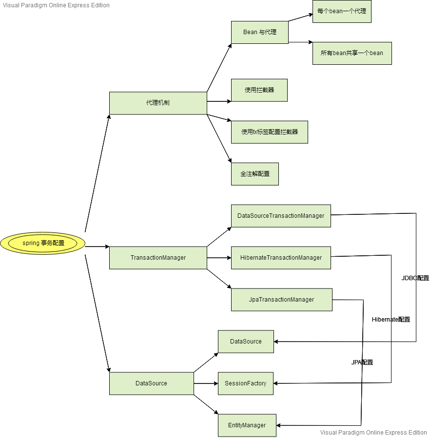

## Spring事务配置

spring 实物配置具有3部分：分别是DataSource、TransactionManager和代理机制这三部分，无论哪种配置方式，一般变化的只是代理机制这部分。 DataSource、TransactionManager这两部分只是会根据数据访问方式有所变化，比如使用Hibernate进行数据访问时，DataSource实际为SessionFactory，TransactionManager的实现为HibernateTransactionManager。

​    具体如下图：



第一种方式：每个Bean都有一个代理:hibernate

```xml
<?xml version="1.0" encoding="UTF-8"?>
<beans xmlns="http://www.springframework.org/schema/beans"
    xmlns:xsi="http://www.w3.org/2001/XMLSchema-instance"
    xmlns:context="http://www.springframework.org/schema/context"
    xmlns:aop="http://www.springframework.org/schema/aop"
    xsi:schemaLocation="http://www.springframework.org/schema/beans 
           http://www.springframework.org/schema/beans/spring-beans-2.5.xsd
           http://www.springframework.org/schema/context
           http://www.springframework.org/schema/context/spring-context-2.5.xsd
           http://www.springframework.org/schema/aop http://www.springframework.org/schema/aop/spring-aop-2.5.xsd">

    <bean id="sessionFactory"  
            class="org.springframework.orm.hibernate3.LocalSessionFactoryBean">  
        <property name="configLocation" value="classpath:hibernate.cfg.xml" />  
        <property name="configurationClass" value="org.hibernate.cfg.AnnotationConfiguration" />
    </bean>  

    <!-- 定义事务管理器（声明式的事务） -->  
    <bean id="transactionManager"
        class="org.springframework.orm.hibernate3.HibernateTransactionManager">
        <property name="sessionFactory" ref="sessionFactory" />
    </bean>
    
    <!-- 配置DAO -->
    <bean id="userDaoTarget" class="com.bluesky.spring.dao.UserDaoImpl">
        <property name="sessionFactory" ref="sessionFactory" />
    </bean>
    
    <bean id="userDao"  
        class="org.springframework.transaction.interceptor.TransactionProxyFactoryBean">  
           <!-- 配置事务管理器 -->  
         <property name="transactionManager" ref="transactionManager" />     
         <property name="target" ref="userDaoTarget" />  
         <property name="proxyInterfaces" value="com.bluesky.spring.dao.GeneratorDao" />
        <!-- 配置事务属性 -->  
        <property name="transactionAttributes">  
            <props>  
                <prop key="*">PROPAGATION_REQUIRED</prop>
            </props>  
        </property>  
    </bean>  
</beans>
```

 第二种方式：所有Bean共享一个代理基类,Hibernate

```xml
<?xml version="1.0" encoding="UTF-8"?>
<beans xmlns="http://www.springframework.org/schema/beans"
    xmlns:xsi="http://www.w3.org/2001/XMLSchema-instance"
    xmlns:context="http://www.springframework.org/schema/context"
    xmlns:aop="http://www.springframework.org/schema/aop"
    xsi:schemaLocation="http://www.springframework.org/schema/beans 
           http://www.springframework.org/schema/beans/spring-beans-2.5.xsd
           http://www.springframework.org/schema/context
           http://www.springframework.org/schema/context/spring-context-2.5.xsd
           http://www.springframework.org/schema/aop http://www.springframework.org/schema/aop/spring-aop-2.5.xsd">

    <bean id="sessionFactory"  
            class="org.springframework.orm.hibernate3.LocalSessionFactoryBean">  
        <property name="configLocation" value="classpath:hibernate.cfg.xml" />  
        <property name="configurationClass" value="org.hibernate.cfg.AnnotationConfiguration" />
    </bean>  

    <!-- 定义事务管理器（声明式的事务） -->  
    <bean id="transactionManager"
        class="org.springframework.orm.hibernate3.HibernateTransactionManager">
        <property name="sessionFactory" ref="sessionFactory" />
    </bean>
    
    <bean id="transactionBase"  
            class="org.springframework.transaction.interceptor.TransactionProxyFactoryBean"  
            lazy-init="true" abstract="true">  
        <!-- 配置事务管理器 -->  
        <property name="transactionManager" ref="transactionManager" />  
        <!-- 配置事务属性 -->  
        <property name="transactionAttributes">  
            <props>  
                <prop key="*">PROPAGATION_REQUIRED</prop>  
            </props>  
        </property>  
    </bean>    
   
    <!-- 配置DAO -->
    <bean id="userDaoTarget" class="com.bluesky.spring.dao.UserDaoImpl">
        <property name="sessionFactory" ref="sessionFactory" />
    </bean>
    
    <bean id="userDao" parent="transactionBase" >  
        <property name="target" ref="userDaoTarget" />   
    </bean>
</beans>
```

第三种方式：使用拦截器  hibernate，通过代理创建器创建代理

```xml
<?xml version="1.0" encoding="UTF-8"?>
<beans xmlns="http://www.springframework.org/schema/beans"
    xmlns:xsi="http://www.w3.org/2001/XMLSchema-instance"
    xmlns:context="http://www.springframework.org/schema/context"
    xmlns:aop="http://www.springframework.org/schema/aop"
    xsi:schemaLocation="http://www.springframework.org/schema/beans 
           http://www.springframework.org/schema/beans/spring-beans-2.5.xsd
           http://www.springframework.org/schema/context
           http://www.springframework.org/schema/context/spring-context-2.5.xsd
           http://www.springframework.org/schema/aop http://www.springframework.org/schema/aop/spring-aop-2.5.xsd">

    <bean id="sessionFactory"  
            class="org.springframework.orm.hibernate3.LocalSessionFactoryBean">  
        <property name="configLocation" value="classpath:hibernate.cfg.xml" />  
        <property name="configurationClass" value="org.hibernate.cfg.AnnotationConfiguration" />
    </bean>  

    <!-- 定义事务管理器（声明式的事务） -->  
    <bean id="transactionManager"
        class="org.springframework.orm.hibernate3.HibernateTransactionManager">
        <property name="sessionFactory" ref="sessionFactory" />
    </bean> 
   
    <bean id="transactionInterceptor"  
        class="org.springframework.transaction.interceptor.TransactionInterceptor">  
        <property name="transactionManager" ref="transactionManager" />  
        <!-- 配置事务属性 -->  
        <property name="transactionAttributes">  
            <props>  
                <prop key="*">PROPAGATION_REQUIRED</prop>  
            </props>  
        </property>  
    </bean>
     
    <!--创建代理 -->
    <bean class="org.springframework.aop.framework.autoproxy.BeanNameAutoProxyCreator">  
        <property name="beanNames">  
            <list>  
                <value>*Dao</value>
            </list>  
        </property>  
        <property name="interceptorNames">  
            <list>  
                <value>transactionInterceptor</value>  
            </list>  
        </property>  
    </bean>  
  
    <!-- 配置DAO -->
    <bean id="userDao" class="com.bluesky.spring.dao.UserDaoImpl">
        <property name="sessionFactory" ref="sessionFactory" />
    </bean>
</beans>
```

第四种方式：使用tx标签配置的拦截器,AOP 与tx 的组合，与拦截器差不多

```xml
<?xml version="1.0" encoding="UTF-8"?>
<beans xmlns="http://www.springframework.org/schema/beans"
    xmlns:xsi="http://www.w3.org/2001/XMLSchema-instance"
    xmlns:context="http://www.springframework.org/schema/context"
    xmlns:aop="http://www.springframework.org/schema/aop"
    xmlns:tx="http://www.springframework.org/schema/tx"
    xsi:schemaLocation="http://www.springframework.org/schema/beans 
           http://www.springframework.org/schema/beans/spring-beans-2.5.xsd
           http://www.springframework.org/schema/context
           http://www.springframework.org/schema/context/spring-context-2.5.xsd
           http://www.springframework.org/schema/aop http://www.springframework.org/schema/aop/spring-aop-2.5.xsd
           http://www.springframework.org/schema/tx http://www.springframework.org/schema/tx/spring-tx-2.5.xsd">

    <context:annotation-config />
    <context:component-scan base-package="com.bluesky" />

    <bean id="sessionFactory"  
            class="org.springframework.orm.hibernate3.LocalSessionFactoryBean">  
        <property name="configLocation" value="classpath:hibernate.cfg.xml" />  
        <property name="configurationClass" value="org.hibernate.cfg.AnnotationConfiguration" />
    </bean>  

    <!-- 定义事务管理器（声明式的事务） -->  
    <bean id="transactionManager"
        class="org.springframework.orm.hibernate3.HibernateTransactionManager">
        <property name="sessionFactory" ref="sessionFactory" />
    </bean>

    <tx:advice id="txAdvice" transaction-manager="transactionManager">
        <tx:attributes>
            <tx:method name="*" propagation="REQUIRED" />
        </tx:attributes>
    </tx:advice>
    
    <aop:config>
        <aop:pointcut id="interceptorPointCuts"
            expression="execution(* com.bluesky.spring.dao.*.*(..))" />
        <aop:advisor advice-ref="txAdvice"
            pointcut-ref="interceptorPointCuts" />        
    </aop:config>      
</beans>
```

第五种方式：全注解   <tx:annotation-driven transaction-manager="transactionManager"/> 代替AOP 与tx:advice

```xml
<?xml version="1.0" encoding="UTF-8"?>
<beans xmlns="http://www.springframework.org/schema/beans"
    xmlns:xsi="http://www.w3.org/2001/XMLSchema-instance"
    xmlns:context="http://www.springframework.org/schema/context"
    xmlns:aop="http://www.springframework.org/schema/aop"
    xmlns:tx="http://www.springframework.org/schema/tx"
    xsi:schemaLocation="http://www.springframework.org/schema/beans 
           http://www.springframework.org/schema/beans/spring-beans-2.5.xsd
           http://www.springframework.org/schema/context
           http://www.springframework.org/schema/context/spring-context-2.5.xsd
           http://www.springframework.org/schema/aop http://www.springframework.org/schema/aop/spring-aop-2.5.xsd
           http://www.springframework.org/schema/tx http://www.springframework.org/schema/tx/spring-tx-2.5.xsd">

    <context:annotation-config />
    <context:component-scan base-package="com.bluesky" />

    <tx:annotation-driven transaction-manager="transactionManager"/>

    <bean id="sessionFactory"  
            class="org.springframework.orm.hibernate3.LocalSessionFactoryBean">  
        <property name="configLocation" value="classpath:hibernate.cfg.xml" />  
        <property name="configurationClass" value="org.hibernate.cfg.AnnotationConfiguration" />
    </bean>  

    <!-- 定义事务管理器（声明式的事务） -->  
    <bean id="transactionManager"
        class="org.springframework.orm.hibernate3.HibernateTransactionManager">
        <property name="sessionFactory" ref="sessionFactory" />
    </bean>
    
</beans>
```

